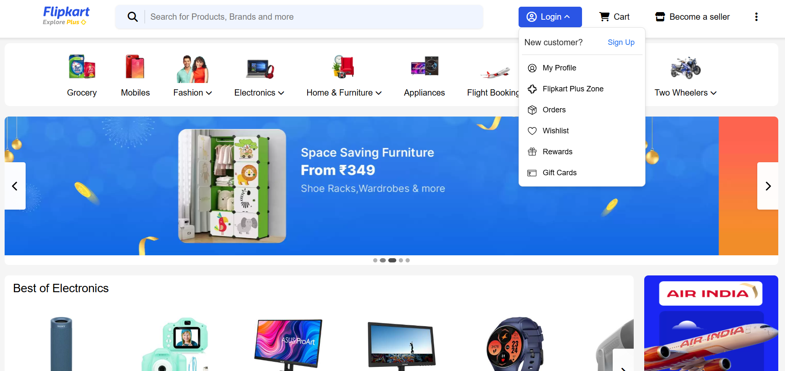
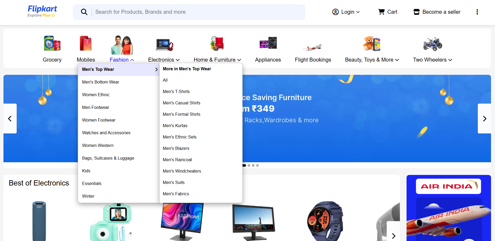
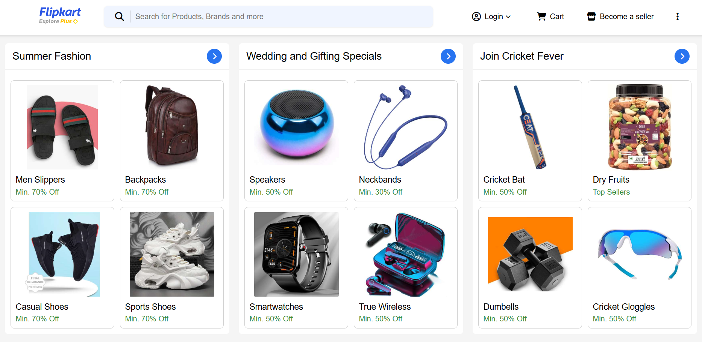

# Flipkart Clone

A responsive web-based clone of Flipkart's user interface, built with HTML, CSS, and JavaScript.

## Features

- Header with logo, search bar, login & cart dropdowns
- Category menu with nested subcategories
- Auto-rotating hero banner slider
- Multiple product carousels with smooth horizontal scrolling
- Fully structured footer with links, social icons & payment methods

## Built With

- 
- 
- 
- 
- 

## Screenshots

### Home Page


### Category Dropdown


### Product Listings


## Installation

1. Clone the repository:
```bash
git clone https://github.com/CodemaxAI/Flipkart-clone.git
cd Flipkart-clone
```

2. Open `index.html` in your web browser to view the project.